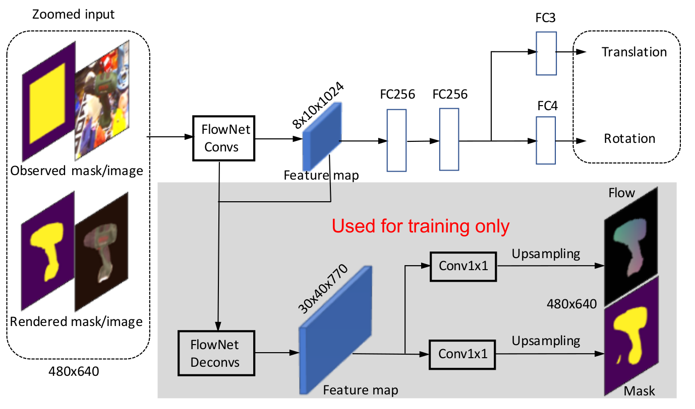
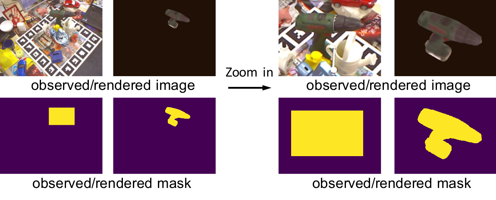
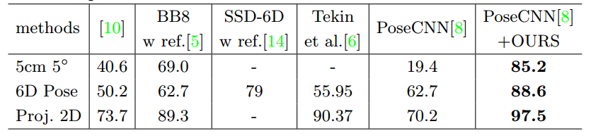
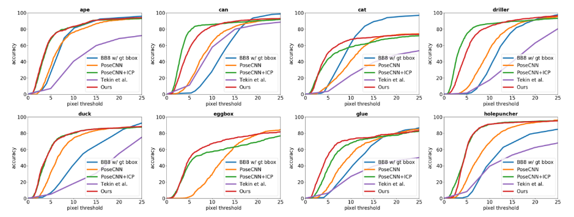
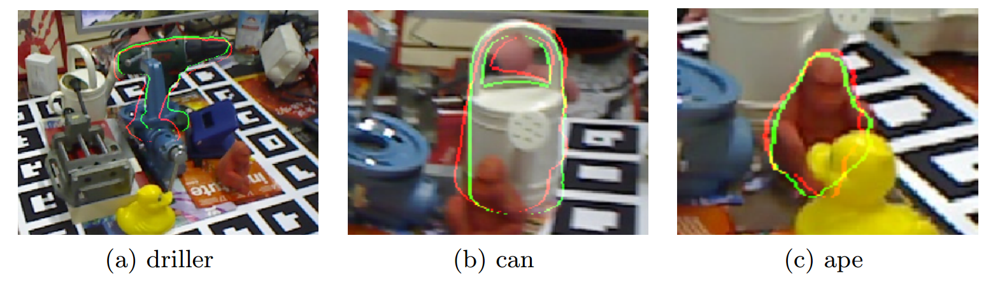
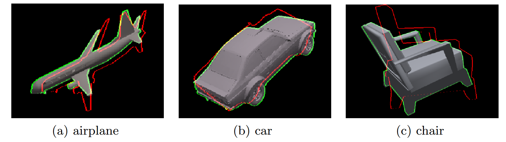

### DeepIM: Deep Iterative Matching for 6D Pose Estimation    
Yi Li, Gu Wang, Xiangyang Ji, Yu Xiang and Dieter Fox.  
In ECCV, 2018.    
[arXiv](https://arxiv.org/abs/1804.00175), [project page](https://rse-lab.cs.washington.edu/projects/deepim/)
    
The major contributors of this repository include [Yi Li](https://github.com/liyi14) and [Gu Wang](https://github.com/wangg12).

### Citing DeepIM
If you find DeepIM useful in your research, please consider citing:
```
@inproceedings{li2017deepim,
title     = {DeepIM: Deep Iterative Matching for 6D Pose Estimation},
author    = {Yi Li and Gu Wang and Xiangyang Ji and Yu Xiang and Dieter Fox},
booktitle = {European Conference on Computer Vision (ECCV)},
year      = {2018}
}
```
## Overall Framework
<p align="center">

<p>

### Network Structure
<p align="center">

<p>

### Zoom In Operation
<p align="center">

</p>


## Main Results

### LINEMOD
<p align="center">

</p>

### Occlusion LINEMOD
<p align="center">

</p>
<p align="center">

</p>

### Unseen Objects from ModelNet
<p align="center">

</p>

The red and green lines
represent the edges of 3D model projected from the initial poses and our refined poses
respectively.

## Requirements: Software

1. Python 2.7. We recommend using Anaconda. (python 3.x should also be OK.)
2. GLFW for OpenGL:
`sudo apt-get install libglfw3-dev libglfw3` (on Ubuntu 16.04)   
3. Python packages might missing:
	```
	conda install scipy
	pip install Cython
	pip install opencv-python
	pip install easydict
	pip install pyyaml
	pip install tqdm
	```
   glumpy:
   ```
   pip install pyopengl packaging appdirs pyopengl triangle cython glfw
   # clone the lastest glumpy (there is a bug in the pip version)
   git clone https://github.com/glumpy/glumpy.git
   cd glumpy
   pip install .
   ``` 	
4. MXNet from [the official repository](https://github.com/dmlc/mxnet).

   *Option 1*: Use the prebuilt version following [the installation guide.](https://mxnet.incubator.apache.org/install/index.html?platform=Linux&language=Python&processor=GPU).
    ```
    nvcc --version
    pip install mxnet-cu90 # (change to your cuda version)
    ```

   *Option 2*. Build MXNet from the source:

    2.1 Clone MXNet and checkout to [MXNet@(commit fc9e70b)](https://github.com/dmlc/mxnet/tree/fc9e70b) by

    ```
    git clone --recursive https://github.com/dmlc/mxnet.git
    cd mxnet
    git checkout fc9e70b (optional)
    git submodule update (optional)
    ```
    or use the latest master directly (code is tested under mxnet 1.2.0).
    
    2.2 Compile MXNet
    ```
    cd ${MXNET_ROOT}
    make -j $(nproc) USE_OPENCV=1 USE_BLAS=openblas USE_CUDA=1 USE_CUDA_PATH=/usr/local/cuda USE_CUDNN=1
    ```

    2.3 Install the MXNet Python binding by

    ***Note: If you will actively switch between different versions of MXNet, please follow 2.4***
    ```
    cd python
    sudo python setup.py install
    ```
    2.4 For advanced users,
    you may put your Python packge into `./external/mxnet/$(YOUR_MXNET_PACKAGE)`,
    and modify `MXNET_VERSION` in `./experiments/deepim/cfgs/*.yaml` to `$(YOUR_MXNET_PACKAGE)`.
    Thus you can switch among different versions of MXNet quickly.
5. Use tensorboard to visualize loss:

    Install [mxboard](https://github.com/awslabs/mxboard) 
    following [https://github.com/awslabs/mxboard#installation](https://github.com/awslabs/mxboard#installation).
    
    ``pip install mxboard`` 


## Requirements: Hardware

Any NVIDIA GPUs with at least 4GB memory should be OK.

## Installation

1. Clone the DeepIM repository, and we'll call the directory that you cloned mx-DeepPose as ${DeepIM_ROOT}.
```
git clone https://github.com/liyi14/mx-DeepIM.git
```

2. Initialize DeepIM:

    2.1 In the root directory of DeepIM, run `sh init.sh` to initialize the DeepIM project.
    (**Note:** For python3, need to install pytorch first to jit compile flow_c module.)

    2.2 (Optional) Delete the data folder and link (i.e. `ln -sf`) the root folder of data to `./data`.
    
     

## Preparation for Training & Testing


1. Prepare datasets, see `./toolkit/` and [prepare_data.md](./prepare_data.md) for details.
   
    The datasets should be put in folder:
	```
	./data/
	```

2. Please download FlowNet model manually from [Google Drive](https://drive.google.com/open?id=1wU1QkG5h5Yyg0G-l9SjoGOIzUgLT4ntR)
 or [Baidu NetDisk](https://pan.baidu.com/s/1qjLw8_gNzcywbWXa2NK9ig) (password: shga), 
and put it under folder `./model`. Make sure it looks like this:
	```
	./model/pretrained_model/flownet-0000.params
	```

## Usage

1. All of our experiment settings (GPU, dataset, etc.) are kept in yaml config files at folder `./experiments/deepim/cfgs`

2. To perform experiments, run the python scripts with the corresponding config file as input. For example, to train and test DeepIM models with pre-trained FlowNet, use the following command
    ```
    python experiments/deepim/deepim_train_test.py --cfg experiments/deepim/cfgs/your_cfg.yaml --gpus 0,1,2,3
    ```
    A cache folder would be created automatically to save the model and the log under `output/deepim/`.
    or you can just run the script like
    ```
    sh train_and_test_deepim_ape.sh
    ```
    to train and test the model only on category ape or run
    ```
    sh train_and_test_deepim_all.sh
    ```
    to train and test the model on all categories.
3. Please find more details in config files and in our code.

## Misc.

Code has been tested under:

- Ubuntu 14.04/16.04 with 4 GTX 1080Ti GPUs or a single GTX 1070 GPU


